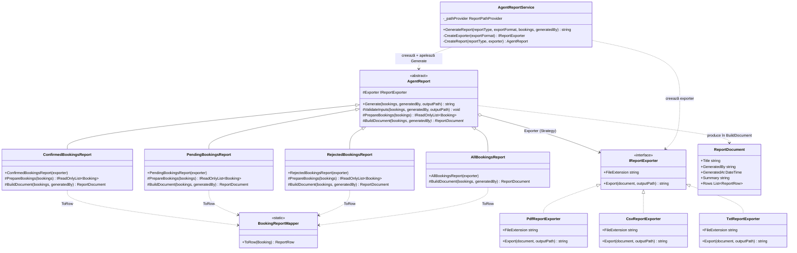

# Template Method (Reporting) — diagramă UML (stil GoF)

În carte: o clasă abstractă `AbstractClass` definește un **template method** (algoritmul fix) care apelează niște **primitive operations** (`abstract`) și/sau **hooks** (`virtual`); subclasele `ConcreteClass` rescriu doar pașii variabili, nu și algoritmul.

Aici: **`AgentReport.Generate(...)`** este template method-ul. El fixează **scheletul** generării unui raport (validare → pregătire → construire document → export), iar subclasele schimbă **doar** filtrarea și conținutul documentului.

Preview Markdown în VS Code / pe GitHub pentru a randa diagrama.

## Algoritmul fix din `Generate` (template method)

`AgentReport.Generate(bookings, generatedBy, outputPath)` apelează **în această ordine**:

1. `ValidateInputs(...)` — *hook* `virtual` (validare default a argumentelor)
2. `PrepareBookings(...)` — *hook* `virtual` (default: returnează lista neschimbată)
3. `BuildDocument(...)` — *primitive operation* `abstract` (obligatoriu de override)
4. `Exporter.Export(document, outputPath)` — pas delegat strategiei (Strategy)

Subclasele **nu** rescriu `Generate` — doar pașii 2 și 3.

## Mapare „manual → proiect”

| Clasic (Template Method) | Implementare |
|--------------------------|--------------|
| `AbstractClass` | `AgentReport` |
| `templateMethod()` (final, non-virtual) | `Generate(...)` |
| `primitiveOperation()` (`abstract`) | `BuildDocument(...)` |
| `hook()` (`virtual`, default util) | `ValidateInputs(...)`, `PrepareBookings(...)` |
| `ConcreteClass` care override pașii | `AllBookingsReport`, `ConfirmedBookingsReport`, `PendingBookingsReport`, `RejectedBookingsReport` |

## Ce variază pe subclasă

| Subclasă | `PrepareBookings` (filtrare) | `BuildDocument` (titlu / summary) |
|----------|------------------------------|------------------------------------|
| `AllBookingsReport` | *default* (nu filtrează) | „All Bookings Report” / `Total bookings: N` |
| `ConfirmedBookingsReport` | `Status == "Confirmed"` | „Confirmed Bookings Report” / `Confirmed bookings: N` |
| `PendingBookingsReport` | `Status == "Pending"` | „Pending Bookings Report” / `Pending bookings: N` |
| `RejectedBookingsReport` | `Status == "Rejected"` | „Rejected Bookings Report” / `Rejected bookings: N` |

## Fișiere

- `TravelAgency.Core/Reporting/Reports/AgentReport.cs` — *AbstractClass* + *template method* `Generate`
- `TravelAgency.Core/Reporting/Reports/AllBookingsReport.cs`
- `TravelAgency.Core/Reporting/Reports/ConfirmedBookingsReport.cs`
- `TravelAgency.Core/Reporting/Reports/PendingBookingsReport.cs`
- `TravelAgency.Core/Reporting/Reports/RejectedBookingsReport.cs`
- `TravelAgency.Core/Reporting/Exporters/IReportExporter.cs` + `Pdf/Csv/Txt` (Strategy pentru pasul de export)
- `TravelAgency.Core/Reporting/Models/ReportDocument.cs`, `ReportRow.cs`
- `TravelAgency.Core/Reporting/Reports/BookingReportMapper.cs`
- `TravelAgency.Core/Services/AgentReportService.cs` — client care alege subclasa și apelează `Generate`
